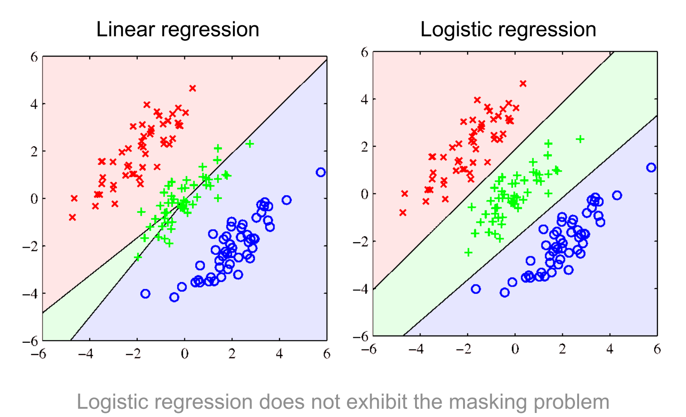
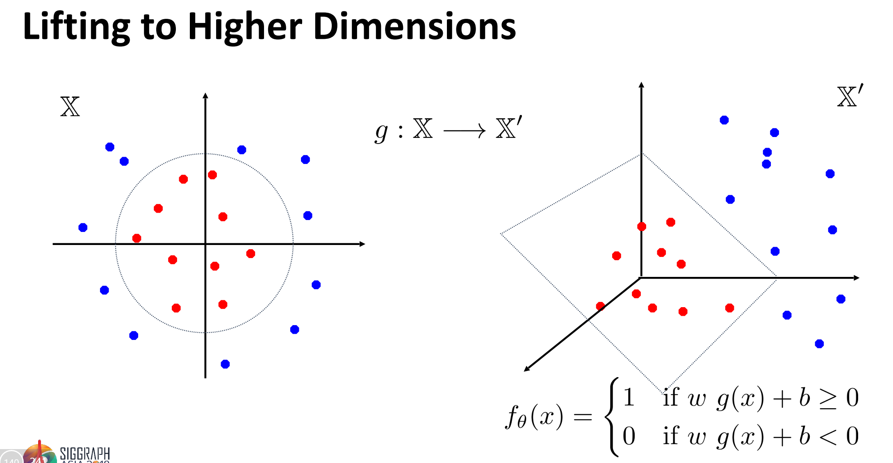

来自Siggraph

<!--more-->
### Machine Learning
`机器学习`是计算机科学的一个领域，这个领域使用<b>统计学</b>的方法让计算机系统使用<b>数据</b>去<b>学习</b>，而不是提前被设计好的。

#### ML种类
- <b>监督类</b>
    - 分类问题
        - Digit Recognition
        - Spam Detection
        - Face detection
    - 回归问题
        - Human Face/Pose Estimation
        - Model Estimation
    - Data consolidation(数据合并？？)
- <b>非监督</b>
    - 聚类（Clustering）
        - Group Points According to X
        
        - Image Segmentation using NCuts
        
    - 降维问题（Dimensionality Reduction）
        - 多种学习融合（Manifold Learning）
- <b>弱监督/半监督</b>
    - 一些数据采用监督， 一些数据非监督
- <b>强化学习</b>
    - Supervision: sparse reward for a sequence of decisions（监督：对一系列决策的稀疏奖励）

<b>PS:</b>
    Segmentation + Classification in Real Images

<b>评价标准</b>: Confusion matrix, ROC curve, precision, recall, etc.

### Learning a Function

$y = f_w(x)$, 其中$y$是预测（prediction）;$f$是预测方法(method)；$w$是参数(parameters);$x$是输入(input).

#### Learning a Linear Separator/Classifier

##### $y = f(w_1x_1 + w_2x_2) = \mathcal H(w_1x_1 + w_2x_2)$
其中$\mathcal H$fixed non-linearity 并且$w_1 ,w_2$是通过学习得到的。

#### Combining Simple Functions/Classifiers

### Regression
#### 1. Least Squares fitting
- Assumption:Linear Function

$$y = f_\mathbf w(\mathbf x) = f(\mathbf x, \mathbf w) = \mathbf w^T\mathbf w \\ \mathbf w^T\mathbf w = \langle \mathbf w^T,\mathbf w \rangle = \sum_{d=1}^D \mathbf w_d \mathbf x_d \\ \bf x \in \mathbb R^D, \mathbf w \in \mathbb R_D$$

- Reminder: Linear Classifier

1.Sum of Square Errors (MSE without the mean)

$y^i = \mathbf w^T\mathbf x^i + \epsilon^i$

loss function:Sum of Square Errors

$L(\mathbf w) = \sum_{i=1}^N(\epsilon^i)^2$

展开：
$L(w_0, w_2) = \sum_{i=1}^N[y_i - (w_0x^i_0 + w_1x^i_1)]^2$

2.Q : what is the best (or least bad) value of w?

$\bf y = \bf X\bf w + \bf \epsilon$

$L(\bf w) = \epsilon^T\epsilon$

$minmize L(\bf w)$

$L(\bf w) = (\bf y - \bf X\bf w)^T(\bf y - \bf X\bf w) = \mid\mid\bf y - \bf X\bf w\mid\mid^2$

$\nabla L = 2\bf X^T(y - Xw) = 0 \Rightarrow w^* = (X^TX)^{-1}X^Ty$ 
[code](https://github.com/dclcs/CG_ML_CODE/blob/master/source/linear_regression.ipynb)
- 超参数
    - 过拟合和未拟合
    
    - 调参
    
    - 交叉验证，选择合适的$\lambda$
    

#### 2. Nonlinear error function and gradient descent
##### 扩展#1:逻辑回归(Logistic Regression)
使用sigmoidal函数$g(\alpha) = \frac{1}{1 + exp(-\alpha)}$ 

##### 扩展#2:处理多个类别的分类问题
C个类别：`one-of-c coding (or one-hot encoding)` 
矩阵记号:
$\mathbf Y = \begin{bmatrix} \mathbf y^1 \\ - \\ .\\ . \\ - \\ \mathbf y^2\end{bmatrix} = \begin{bmatrix} \mathbf y_1 \mid ... \mid \mathbf y_{\mathbf c}\end{bmatrix}$,其中$\mathbf y_{\mathbf c}=\begin{bmatrix} y_1 \\...\\ y_c^N\end{bmatrix}$, $W = \begin{bmatrix} \bf w_1 \mid ... \mid w_c\end{bmatrix}$ 
损失函数：
$L(W) = \sum^C_{c=1}{(\bf y_c - Xw_c)^T(y_c - Xw_c)}$ 
Least squares fit:
$\bf w_c^* = (X^TX)^{-1}X^Ty_c$
##### Logistic vs Linear Regression (n > 2 classes)

##### 交叉熵的梯度
- $L(\mathbf w) =-\sum_{i=1}^Ny^i\log g(\mathbf w^T \mathbf x^i) + (1-y^i)\log (1-g(\mathbf w^T\mathbf x^i))$
- $\nabla L(\mathbf w^*) == 0$
- initialize : $\mathbf x_0$
- Update: $\mathbf x_{i+1} = x_{i} - \alpha \nabla f(\mathbf x_i)$

##### XOR 问题
- [code](https://github.com/dclcs/deep_learning_with_python_code/blob/master/deep_learning_with_python_code_ch2.ipynb)
- [描述](https://dclcs.github.io/post/dl-with-py-ch2.html)

#### 3.感知训练(简单神经网络)

- 
##### 多层感知机
- 输入向量
- 隐藏层
- 输出
##### 神经网络训练：旧和新的技巧
- Old
    - 反向传播
        - 训练目标
            - 我们的网络实施是一个参数化函数 $f_\theta: \mathbb X \to \mathbb Y$, $\widehat y = f(x;\theta)$
            - 在训练过程中，我们寻找一个参数最小化损失函数:${min}_\theta L_f(\theta)$
            - 例子：L2 regression loss
        - 梯度
            - 前向传播
            - 反向传播
    - 随机梯度、动量、权重延迟（`weight decay`）
- New
    - Dropout
    - Relu
    - Batch Norm(alization), GroupNorm, Spectral Normalization
    - Res(idual)Net(work)

