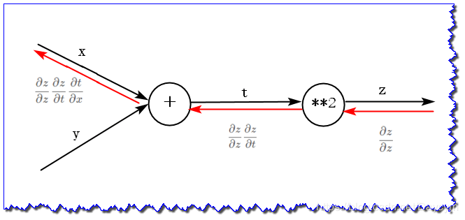

deep learning with python

<!--more-->

### 5.1 计算图
- 局部计算
### 5.2 链式法则
- 计算图的反向传播
    - $y = f(x)$
    - 乘上局部导数
#### 5.2.2 链式法则
- $\frac{\partial z}{\partial x} = \frac{\partial z}{\partial t}\frac{\partial t}{\partial x}$
#### 5.2.3 链式法则与计算图
- 
### 5.3 反向传播
### 5.4 实现乘法节点和加法节点
### 5.5 激活函数的实现
#### 5.5.1 ReLU 层
- $y = \begin{cases}x & (x \gt 0) \\\ 0 & (x \le 0)\end{cases}$
- $\frac{\partial y}{\partial x} = \begin{cases}1 & (x \gt 0) \\\ 0 & (x \le 0)\end{cases}$
#### 5.5.2 sigmoid层
- $y = \frac{1}{1 + exp(-x)}$
- $\frac{\partial y}{\partial x} = \frac{exp(-x)}{(1+exp(-x)^2)} = exp(-x)y^2 = (1-y)y$,($exp(-x) = \frac{1-y}{y}$) 
### 5.6 Affine/Softmax 层
#### 5.6.1 Affine层
- 正向传播中进行的矩阵的乘积运算称为“放射变换”
#### 5.6.2 批版本的Affine层
#### 5.6.3 Softmax-with-loss
- 除了softmax层之外还包括交叉熵误差（cross-entropy error)
- softmax: $y_k = \frac{exp(a_k)}{\sum^n_{i = 1}exp(a_i)}$
- 交叉熵: $L = -\sum_kt_klogy_k$
- $\frac{\partial L}{\partial a_k} = \frac{\partial L}{\partial y_k}\frac{\partial y_k}{\partial a_k} =-t_k\frac{1}{y_k}(\frac{exp(a_k)\sum_{i=1}^nexp(a_i) - exp(a_k)^2}{(\sum_{i=1}^nexp(a^i))^2}) =-t_k\frac{1}{y_k}(\frac{exp(a_k)}{\sum_{i=1}{n}} - (\frac{exp(a_k)}{\sum_{i=1}^n})^2) = -t_k\frac{1}{y_k}(y_k - y_k^2) = t_k(y_k - 1)$