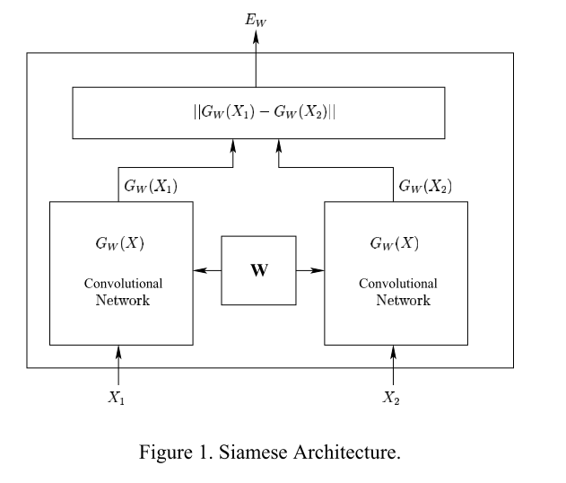
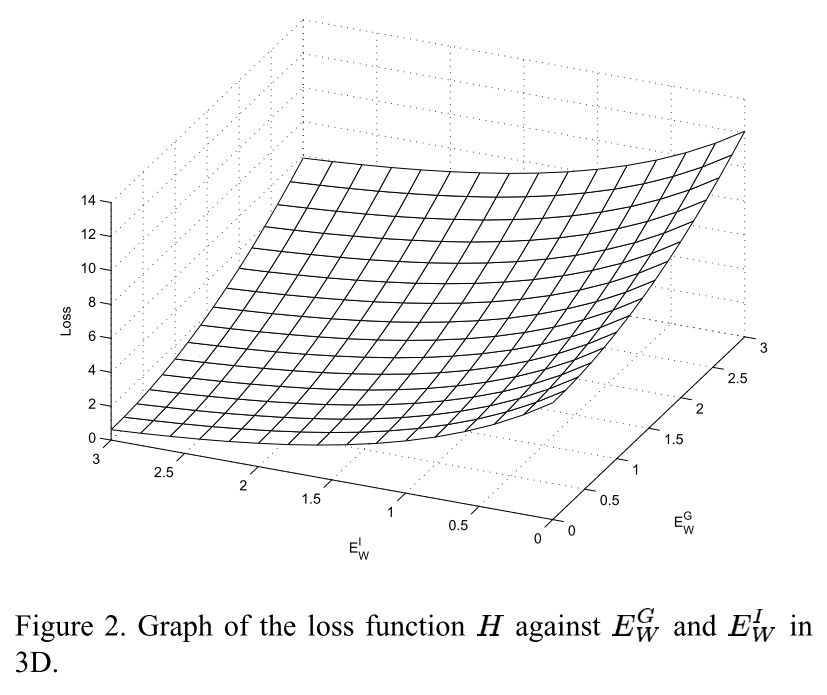

翻译：Learning a Similarity Metric Discriminatively, with Application to Face Verification
<!--more-->
# 1.Introduction
传统的方法使用对抗的方法（`discriminative methods`）解决识别问题，例如神经网络或者SVM，通常需要所有的类别（`categories`）提前知道。这些方法同样需要所有类别的训练例子都可以被使用。更重要的是，这些方法本质上受限于相当少的类别个数。这些方法不适合那些类别比较大的应用，和那些在训练过程中只知道类别的一部分子集的应用。这些应用包括人脸识别和人脸认证：类别的数量可以是几百或者上千，然鹅只有很少的例子对于每个类别。解决这类问题的常见的方法是基于距离（`distanced-based method`）的方法，基于距离的方式通过计算两个模式（`two patterns`）或者一个的相似矩阵来进行认证或者识别或者计算 `a library of stored prototypes`.另外一种常见的作法是降维操作（`reduced-dimension space`),这个方法中一个类别的训练只需要很少的样本数。为了应用对抗的学习技巧到这类问题，我们必须设计出一个方法，这个方法能够从足够的数据中提取有关问题的信息，但是不需要每个类别的精准的信息。 
本文提出的解决方法是从数据在学习相似矩阵(`learn a similarity metric from data`)。这个相似矩阵能够用来比较或者匹配之前没有见过的类别中样本（例如：在训练过程中没有的人脸）。我们提出一个新的对抗训练方法，用来寻来你相似矩阵。这个方法能够应用到类别的数量非常大或者类别中的例子不够再训练过程中的识别问题。 
这个方法的核心思想就是寻找一个函数，这个函数将输入模式（`input patterns`）映射到目标空间（`target space`），并且目标空间中的单一距离（`simple distance`）（欧拉距离）近似于输入空间的“语义”距离。更准确的来说，给定一簇函数（`a family of functions`）$G_W(X)$（其中$W$是参数）,我们要求寻找一个参数$W$，并且如果$X_1,X_2$属于相似的类别，相似矩阵$E_W(X_1,X_2) = \mid\mid G_W(X_1) - G_W(X_2) \mid\mid$会很小，相反如果属于不同的类别会很大。这个系统从训练集中匹配进行训练（`the system is trained on pairs of patterns taken from a trainning set`)。损失函数在$X_1$和$X_2$属于相似类别时，最小化$E_W(X_1,X_2)$并且在$X_1$和$X_2$属于不同类别时，最大化$E_W(X_1, X_2)$。对于不同的$W$,$G_W(X)$没有做任何前提假设。因为对于同样的参数$W$,同样的函数$G$被用来处理一样的输入，相似矩阵时对称的。这被称作孪生结构(`siamese architecture`) 
为了使用这种方法去搭建人脸识别系统，我们首先训练模型产生输出向量，这些向量在处理来自同一个人的照片会很接近，处理来自不同人的照片会很远。这个模型能够被用做相似矩阵在一个新的人脸的照片。 
这个方法提出的一个非常重要的观点是我们用完全的自由在选择$G_W(X)$。尤其是我们将会使用那些设计好去提取输入的几何失真的架构，例如卷积神经网络。产生的相似矩阵将会非常健全产生非常少的区别。 
因为目标空间的维度非常小并且自然距离对于不相关的输入是不变的，我们能够轻松的从非常小的样本量中估计每个新的类别的概率模型。
## 1.1 Previous Work
在比较之前将人脸照片映射到低位目标空间有一个较长的历史，从基于PCA的`Eigenface`方法开始，`Eigenface`方法中$G(X)$是一个线性投影，并且训练采取的是非对抗的方法去最大化方差。基于LDA的`Fisherface`方法也是线性的，但是是对抗来训练为了最大化类间和类内方差的比率。基于核-PCA和核-LDA的非线性的扩展已经讨论过。可以看一下有关人脸识别的子空间的方法的评论（`See for a review of subspace methods for face recognition`）。这些方法的一个最主要的缺点就是它们对输入图片的几何变换（`shift, scaling, rotation`）和变形（人脸标签、眼睛和遮挡物的变化）和非常敏感。一些学者已经描述相似矩阵具有局部不变性对于一些列一直的变换。一个例子就是`Tangent Distance method`。另一个例子是`elastic maching`,这已经应用在人脸识别中。另外的学者提倡`wrap-based normalization`算法来最大程度上减少由于姿势的不同的变量的出现。这些模型的不变的性质是手动提前设置好的。在本文中提到的方法，不变的性质不是从有关这个任务的先验知识中得到的，而是从数据中学到的。当使用卷积网络作为映射函数，我们提出的方法可以从数据中学到一个大范围的不变的性质。 
我们的方法在某种程度上与文献[4]类似，文献[4]使用一种孪生的架构来实现签名识别。这个方法与我们的方法的主要的区别在于在训练过程中最小化损失函数的特性。我们的损失函数从对抗学习的架构中派生出来应用于EBM（基于能量的模型， `energy-based models`）。 
我们的方法于其他降维的方法例如MDS（`Multi-Dimensional Scalling`）和LLE（`Local Linear Embedding`）又很大的不同。MDS基于成对的差异，而不是构建一个映射关系，从训练集中的每个输入物体计算目标向量。相反的，我们的方法产生一个非线性的映射关系，这个映射关系能够将输入向量映射到一个对应的低维向量。

# 2. The General Framework
虽然概率模型为正在建模的变量分配一个归一化的概率给每个可能的配置，但是EBM能够分配一个非归一化的能能量给这些配置。这种系统中的预测通过搜索最小化能量变量的配置来执行。EBMs应用于各种配置的能量必须进行比较来做出抉择（分类、验证等等。。。）。一个可以训练的相似矩阵能被看作一个能量$E_W(X_1,X_2)$和输入模式的匹配。在最简单的人脸验证射中中，我们简单的设$X_2$是所有可以的照片的生成身份id并且与最小化$E_W(X_1，X_2)$得到的提前决定的阈值做比较。 
与传统概率模型相比，特别是产生模型，EBM的优势在于没有必要估计输出空间规范化的概率分布。没有规范化保证我们不去计算那些部分比较棘手的函数。这也能够给我在选择模型的架构时相对更自由。 
学习通过寻找$W$来最小化一个合适设计好的损失函数，并且在训练集上进行评估。首先，我们可能会认为简单的在一个平均输入和相同类中进行最小化$E_W(X_1,X_2)$会很充分。但是这通常会导致一个重大的灾难：能量和随时可能会变为0通过简单将$G_W(X_1)$变成不变的函数。因此我们的损失函数需要一个对比用语(`constrstive term`)去确保不仅仅与来自相同类别的与输入匹配的能量比较小，并且来自不同种类的很大。这个问题不会发生在相对规范化的概率模型因为在一个特定匹配的概率会比较高而在其他匹配中会很低。
## 2.1 Face Vertification with Learned Similarity Metrics
人脸验证的任务时接受或者拒绝图像中主题的身份认证。通过两个标准来评估表现：错误接受率和错误拒绝率。一个好的人脸验证系统应该最小化这两个标准同时。 
我们的方法是为了建立一个可以训练的系统，这个系统是非线性的将人脸的原生图片映射到一个低位空间中的点并且如果这些图片属于同一个人这些点的距离会非常小，如果属于不同人则会非常大。学习相似矩阵可以通过训练一个有两个`identical`卷积神经网络并且这两个网络共享同样的权重来实现，这个结构也成为孪生结构`A Siamese Architecture`。

## 2.2 The energy function of the EBM
机器学习的框架如上图。$G_W(X)$框架的细节将在第3.2节。 
设$X_1，X_2$为一对图片展示在我们的学习机器中。设$Y$为这组的二值标签，如果$X_1,X_2$同属于一个人则$Y=0$(也被称作“一个真正的匹配”)否则则$Y=1$("一个假的匹配")。设$W$为共享的参数向量，与学习有关，并且设$G_W(X_1)$和$G_W(X_2)$是低维空间中的两个点，是$X_1$和$X_2$的映射。然后我们的系统可以被认为是一个标量“能量函数”$E_W(X_1,X_2)$，用来度量$X_1$和$X_2$的兼容性(`compatibility`)。它被定义为：

$$E_W(X_1, X_2) = \mid\mid G_W(X_1) - G_W(X_2) \mid\mid$$
假设训练集中一个正真的匹配$(X_1, X_2)$，并且一个假的匹配$(X_1^{'}, X_2^{'})$如果下列条件满足的话，机器会按照我们所像的方向进行表现： 
<b>条件1：</b>$\exists m \gt 0, such\ that\ E_W(X_1,X_2) + m \lt 0$。其中，正数$m$可以被解释为边界(`margin`) 
为了简单的标记$E_W(X_1,X_2)$,可以简写为$E_W^G$并且$E_W(X_1,X_2^{'})$写为$E_W^I$。

## 2.3 Contrastive Loss Function used for Training
我们假设损失函数取决于输入并且参数只是直接通过能量。我们的损失函数为： 

$$\mathcal L(W) = \sum_{i=1}^PL(W,(Y,X_1,X_2)^i)$$

$$L(W,(Y,X_1,X_2)^i) = (1-Y)L_G(E_W(X_1,X_2)^i) + YL_I(E_W(X_1,X_2)^i)$$
其中$(Y,X_1,X_2)^i$为第i个样本，有一组图片和一个标签组成（可能是真的组合也可能是假的组合），$L_G$是一个部分损失函数对于一个真的组合，$L_I$是一个部分损失函数对于一个假的组合，并且$P$是训练样本的个数。$L_G$和$L_I$应该一某种方式进行设计，这种方式是最小化$L$将会减少真实匹配的能量并且增加增加假匹配的数量。一个简单方法去实现这的方法是使$L_G$单调递增，$L_I$单调递减。然而，存在一个更普遍的条件，最小化$L$将使得机器更接近<b>条件1</b>。我们的做法和LeCun提出的类似。我们考虑到一个训练级有真实匹配$(X_1, X_2)$、能量$E_W^G$ 和错误匹配$(X_1,X_2^{'})$、能量$E_W^I$。那么我们定义: 

$$H(E_W^G,E_W^I) = L_G(E_W^G) + L_I(E_W^I)$$

作为全部的损失函数对于两个匹配。我们将假设$H$对于它的两个参数是凸的（注意：我们不认为对于$W$，$H$是凸的）。我们也假设存在$W$队医一个单一的训练样本<b>条件1</b>是满足的。下面的条件必须满足对于损失函数$H$所有的值$E_W^G$和$E_W^I$

<b>条件2</b> $H(E_W^G, E_W^I)$的最小值应该在$E_W^G + m \lt E_W^I$的半平面。 
这个条件清楚的保证了当我们最小化$H$对应一个参数$W$,机器可以达到满足这个<b>条件1</b>的区域。 
对于$H$的最小值存在有限区域，下面的条件是充分的：

<b>条件3</b>$H(E_W^G,E_W^I)$的负梯度在边缘线$E_W^G + m = E_W^I$有一个正点积方向在$[-1, 1]$之间。 
为了证明这些，我们陈述并且证明以下的理论。 
<b>理论1：</b>假设$H(E_W^G,E_W^I)$在参数$E_W^G$和$E_W^I$为凸并且在有限区间有一个最小值。假设存在一个$W$并且<b>条件1</b>满足。如果<b>条件3</b>满足，然后给定$W$最小化$H$时会导致发现满足<b>条件1</b>的$W$。 
<b>证明：</b>考虑由$E_W^G$和$E_W^I$组成的平面的正象限的区域。假设两个半平面$E_W^G + m \lt E_W^I$ 和 $E_W^G + m \ge E_W^I$ 分别记为$HP_1$和$HP_2$。我们在$E_W^G$和$E_W^I$最小化$H$对于在任意$W$的区域内。假设$\mathcal R$作为$E_W^G$和$E_W^I$形成的平面内的内部区域。在大多数设置的。。。(略)