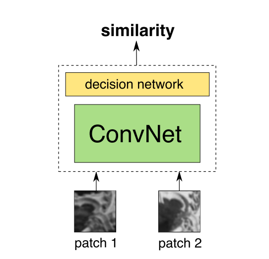

翻译: 
Learning to Compare Image Patches via Convolutional Neural Networks
<!--more-->

### Abstract
这篇文章我们展示了如何直接从图片信息（例如：不需要存储人为设计的特征）产生一个相似函数，这个相似函数是用来解决比较两张图片的问题，这个问题是很多cv问题的基本问题。为了加密这个函数，我们采取了一个基于卷积网络的模型，这个用变化的图片进行训练。训练完成后，我们探索和学校多种神经网络结构，这些结构我们应用于这项工作。我们展示了这个方法，这个方法能优于几个问题和一些基准数据库的`state-of-art`。 
### 1. Introduction
比较两张图片可能是计算机视觉领域和图片分析的最基本的任务之一。比较两者图片通常作为一个子程序再多种视觉任务中扮演重要的作用。这些能够从一些低级的任务如`structure from motion`，`wide baseline matching`，`building panoramas`和`super-resolution`到高级应用如`object recognition`，`image retrieval`和`classification of object categories`再到一些角色例子（`characteristic examples`）。 
当然，决定两张图片是否是一样或者不一样是一个相当困难的问题因为存在很多因素影响最后图片的外观。这些包括视点的变化、各种场景的总体光照的变化、遮挡、阴影和相机设置上的不同等等。实际上，许多手动设计特征表述在比较图片方向上有很大的发展，包括`SIFT`，`SIFT`在计算机视觉社区有很大的影响。但是，这种人为设计描述可能没有考虑在那些决定图片外观的先前因素考虑进去。另一方面，如今一个能够容易得到（或者用软件产生）的包含图片之间的对应关系的大型数据库。这提出如下的问题：我们能够合理的使用这些数据库，自动的学到图片匹对的相似函数？ 
这篇文字的目标是肯定地解决上述问题。因此我们的目标是从`scratch`没有尝试使用人为设计特征而是直接从标记的原生图片学到的函数产生一个图片匹配相似函数。最后，收到最近神经网络和深度学习的发展，我们选择用深度卷积网络来表达这个函数。为了做这些，我们也感兴趣解决什么样的网络结构最好的应用在这个问题。我们因此探索和提出各种各样的网络的类型，这种架构有不同的权衡和优势。在这些所有的例子中，为了训练这些网络，我们使用一个一个大型的包括原生图片的匹配的数据库作为单一的输入。这需要我们简单的通过丰富这个数据库更进一步改善我们方法的表现（因为那些自动产生图片的软件确实足够的）。 
为了总结这个部分，本文的主要贡献如下：
- 我们直接从数据中（例如，没有使用任何人工设计的特征）得到一个相似函数，这个相似函数能够隐士的将转换和影响考虑进去（由于，包括`a wide baseline`, `illumination`等等）。
- 我们发现和提出一个多种不同的神经网络模型来表达这个函数，同时图吃提出了改善的网络架构，如文献[10]
- 我们将我们的方法应用到几个应用和`benchmark dataset`，展示出比`state-of-the-art`更好的优势，也说明比图片特征描述比人工特征描述有更好的表现或者其他学到的描述正如文献[19]中提到的。 
更重要的是，由于卷积的特征，最后结果描述即使在一个密集的方法(`a dense manner`)也有很有效率。

### 2.Related Work
用卷积的方法去比较两个图片是使用描述符和一个欧拉平方距离。大多数的描述符是手动构造的例如`SIFT`或者`DAISY`。最近，学习一个描述符的方法已经被提出来了（例如：`DAISY-like`的描述符学习池化区域和降维操作）。`Simonyan et al`提出一个对于训练所有的任务凸的程序。 
然而，我们的方法受到最近卷积神经网络的发展的启发。虽然这些模型在训练过程中涉及到一个高的非凸的目标函数，他们已经在各种各样的任务中展现出优异的结果。`Fischer et al.`从`AlexNet`网络（`AlexNet`也是在`Imagenet`数据库上训练的）中分析卷积描述符的表现并且显示出这些卷积描述符在很多案例除了模糊上比`SIFT`有更好的表现。它也提出了一个无监督的训练方法推导出比`SIFT`和`Imagenet`训练好的网络更好的描述符。 
`Zbontar`和`LeCun`在文献[28]最近提出了一个基于CNN的方法来比较两个图片，这个方法在一个很小的基线的具体问题来计算损失并且显示出最好的在`KITTI`数据库的表现。然而，这个工作的重点仅仅是在一个狭小的基线具体问题中的非常小的匹配关系中进行匹配。相反的，我们的目标在于得到一个相似函数，这个函数能够解决一个更为宽泛的更加有挑战的应用中，包括，例如，`wide baseline stereo`、`feature matching`和`image retrieval`。 

### 3.Architectures
正如已经提到的，神经网络的输入为一组图片的匹配。我们的模型没有强加一些与输入通道数有关的限制，即给定一个彩色图片的数据库网络能够被训练到更好的表现。然而，为了能够将我们的方法和`state-of-the-art`方法在现存的数据库相比较，我们仅仅在训练过程中训练灰度图像。更重要的是，在`3.2`部分描述了`SPP`模型的期望，在这些例子中我们嘉定给网络的输入固定为64x64（这意味着原始的图片可能必须`resize`到上面描述的空间维度）。 
有几种方法来通过网络处理匹配的图片和如何在这些例子中共享信息。处于这个原因，我们探索和测试了集中方法。我们从`3.1`部分开始描述我们研究的三种基本的神经网络架构即，`2-channel`、`Siamese`、`Pseudo-siamese`，这些方法在速度和准确度上提供了不同的优势（注意：通常应用到图片匹配技术暗示测试一个图片和一个大规模的其他图片进行匹配，并且按照这样来看重新使用计算好的信息通常是有用的）。重要的是，这些架构来愿意不同的方法，并且这些方法都尝试去解决如下的几个问题：当组成一个比较图片的相似函数的时候，我们是否要选择去计算每个图片的描述符？或者我们是否要选择跳过那些与描述符计算相关的部分并直接处理相似估计？ 
另外，处理上面的基本模型，我们也在`3.2`部分讨论一些与网络结构有关的额外的变量。这些变量不是相互独立的，并且这些变量能够与在`3.1`部分描述的基本模型相关联。总之，这些意味着多种模型可以应用于比较图片。

#### 3.1 Basic Models

- 孪生网络（`Siamese`）：这种类型的网络与有一个描述符类似。孪生网络有两个分支，这两个分组共享同样的架构同样的权重。每一个分支的输入为匹配图像的一张图片，并且通过一系列的卷积层、`ReLU`和最大池化层。在我们的测试中，我们使用一个顶层网络，这个顶层网络包含2个线性全连接层（每个有512个隐藏单元），这两个全连接层由一个ReLU激活层分开。 
孪生网络的每个分支被看作描述符计算模块（`ddescriptor computation modules`）和顶层网络---可以看作相似函数（`similarity function`）。