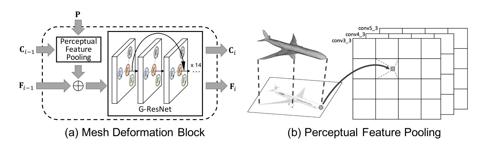

### Method
#### 1. Graph-based Convolution

一个3D的Mesh可以看成点、边和面的集合。可以表示成$\mathcal M =(\mathcal V,\mathcal \varepsilon,\mathbf F)$,
其中 $\mathcal V = \\{v_i\\}_{i=1}^N$ 为`mesh`中 $N$ 个点的集合;
$\varepsilon = \\{e_i\\}_{i=1}^E$ 为边的集合;
$\mathbf F=\\{f_i\\}_{i=1}^N$为每个点上的`特征`的集合.

在一个不规则的图上基于图卷积的定义为：

$$f_p^{l+1} = w_0f_p^l + \sum_{q \in \mathcal N(p)}w_1f_q^l$$

其中，$f_p^l \in R^{d_l}$,$f^{l+1}_p \in R^{d_l+1}$ 分别点$p$在卷积前后的特征向量；$\mathcal N(p)$ 为点 $p$  的相邻的点；$w_0$和$w_1$是需要学习到的参数，其`shape`为$d_l \times d_{l+1}$;

在这篇文章中，特征向量$f_p$为**点的3D坐标**、**`feature encoding 3D shape`**和**输入的彩色图片的特征**（如果存在的话）。

#### 2. System Overview

整个框架包含两个分支：一个图片特征网络和一个级联的`mesh`变形网络。

图片特征网络是一个2D 的CNN，从输入的图形中提取`perceputal feature`；`perceputal feature`是用来让`mesh`变形网络不断进行变形，从一个椭圆的网格到理想状态下的网格。

级联的`mesh`变形网络是一个`GCN`，包含3个`deformation block`和两个`graph unpooling layer`。每个`deformation block`的输入为表示当前`mesh`的图，输出为新的点的位置和特征。而`graph unpooling layers`会点的个数，这是因为为了增加处理细节的能力同时保证`mesh`的拓扑结构。

使用的损失函数包括3个：`Surface normal loss`、`Laplacian regularization loss`、`Edge length loss`

#### 3. Initalize ellipsoid

椭球`mesh`位于相机前0.8m处，并且三个轴的大小为0.2m,0.2m,0.4m;并且包含156个点

#### 4. Mesh deformation block

为了产生图片中物体的`mesh`，`deformation block`需要输入图片的池化的特征（$\mathbf P$）。$\mathbf C_{i-1}$代表当前`mesh`点的位置。$\mathbf F_{i-1}$代表当前`mesh`的特征。

**Perceptual feature pooling layer**
给定一个点的3D坐标，使用相机的内在参数计算其在图片平面上的2D投影，然后用双线性插值（`bilinear interpolation`）`pool the feature from four nearby pixels`。
