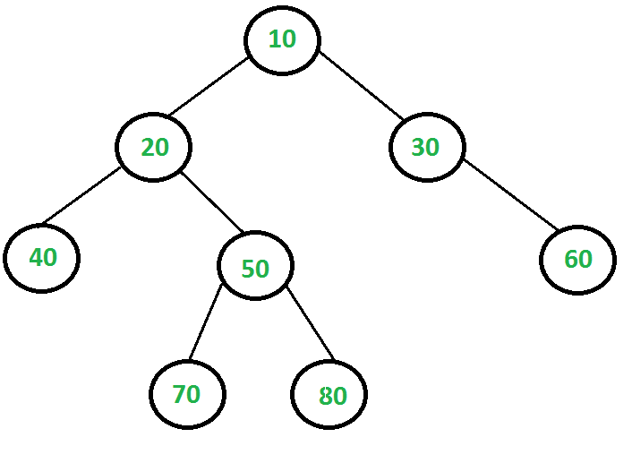

#### 问题一：子串出现的次数

**问题描述**

- 给定两个字符串，找出第二个字符串在第一个字符串中出现的次数，无论是连续的还是不连续的。

- Examples:
    - Input:
        - string a = "GeeksforGeeks"
        - string b = "Gks"
    - Output
        - 4


**分析**

无论从左往右还是从右往左，遍历所有的字符，如果`str1[i] == str2[j]` ，则计算`count(str1[i + 1], str2[j + 1]) + count(str1[i + 1] , str2[j])`；如果`str1[i] != str2[j]`则`i ++`


```c++
int count(string a, string b, int m, int n){
    if(n == b.size()){
        return 1;
    }
    if(m == a.size()){
        return 0;
    }

    if(a[m] == b[n]){
        return count(a, b, m + 1, n + 1) + count(a, b, m + 1, n);
    }else{
        return count(a, b, m + 1, n);
    }
}
```

上面的算法复杂度是指数级的，这里有许多子问题被重复计算了。这时可以考虑使用动态规划，`lookup[i][j]`表示`s2`以`j`开始的子串在`s1`以`i`开始的序列中出现的次数。代码如下：
```c++
int count_dp(string a, string b){
    int m = a.size();
    int n = b.size();

    int lookup[m + 1][n + 1] = {{0}};


    for(int i = 0 ; i <= n ; i ++) lookup[0][i] = 0;
    for(int i = 0 ; i <= m ; i ++) lookup[i][0] = 1;

    for(int i = 1; i <= m ; i ++){
        for(int j = 1; j <= n; j ++){
            if(a[i - 1] == b[j - 1]){
                lookup[i][j] = lookup[i - 1][j - 1] +
                        lookup[i - 1][j];
            }else{
                lookup[i][j] = lookup[i - 1][j];
            }
        }
    }

    return lookup[m][n];
}
```


### 问题二：最大独立集合
**问题描述**
- 给定一个节点数为`N`的二叉树。如果所有树节点的子集的任意两个节点之间没有边，那么这个子集就是一个独立集。


- Example
    - Input:
    
    

    - Output:
        - 5
        - [10, 40, 60, 70, 80]


**分析**

仔细分析，对于任何一个节点，这个节点有两个选择：如果这个节点在最大独立集中；或不在最大独立集中。

最优结构：
```c
LISS(x) = MAX{(1 + sum of LISS for all grandchildren of X),             (sum of LISS for all children of X)}
```

递归实现：
```c++
class node{
public:
    int data;
    node* left, *right;
    node(int _data): data(_data), left(nullptr), right(nullptr) {}
};

int LISS(node* root){
    if(!root) return 0;

    int size_excl = LISS(root->left) + LISS(root->right);

    int size_incl = 1;
    if(root->left){
        size_incl += LISS(root->left->left) +
                LISS(root->left->right);
    }

    if(root->right){
        size_incl += LISS(root->right->left) +
                LISS(root->right->right);
    }
    return max(size_excl, size_incl);
}
```
因为有重叠子问题，可以在`node`中添加新的变量`liss`代表当前节点的`LISS`值。

```c++
class node{
public:
    int data;
    int liss;
    node* left, *right;
    node(int _data): data(_data), left(nullptr), right(nullptr) ,liss(0){}
};

int LISS(node* root){
    if(!root) return 0;
    if(root->liss) return root->liss;
    if(root->left == nullptr && root->right == nullptr) return (root->liss = 1);

    int size_excl = LISS(root->left) + LISS(root->right);

    int size_incl = 1;
    if(root->left){
        size_incl += LISS(root->left->left) +
                LISS(root->left->right);
    }

    if(root->right){
        size_incl += LISS(root->right->left) +
                LISS(root->right->right);
    }

    root->liss = max(size_incl, size_excl);
    return root->liss;
}
```