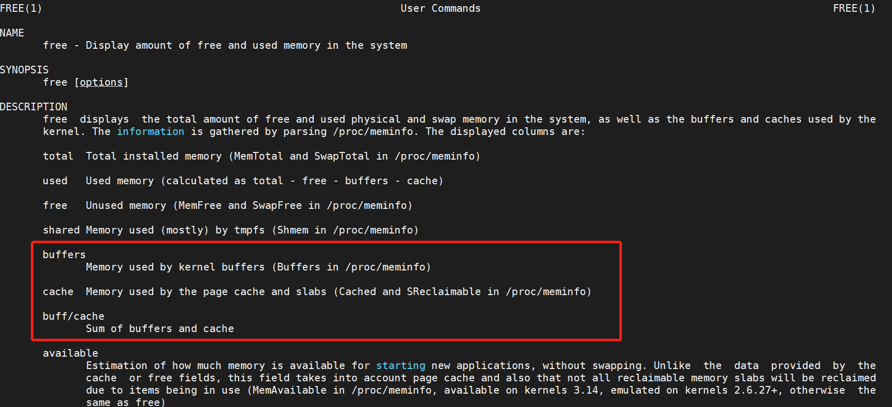

```shell
(base) server@server:~$ free
              total        used        free      shared  buff/cache   available
Mem:       32554244    10453196     3655320      708840    18445728    20816460
Swap:             0           0           0
```


### free 数据的来源




- Buffers 是内核缓冲区用到的内存，对应的是 /proc/meminfo 中的 Buffers 值。
- Cache 是内核页缓存和 Slab 用到的内存，对应的是 /proc/meminfo 中的 Cached 与 SReclaimable 之和。


### proc 文件系统
- /proc 是 Linux 内核提供的一种特殊文件系统，是用户跟内核交互的接口。比方说，用户可以从 /proc 中查询内核的运行状态和配置选项，查询进程的运行状态、统计数据等，当然，你也可以通过 /proc 来修改内核的配置。
- proc 文件系统同时也是很多性能工具的最终数据来源。比如我们刚才看到的 free ，就是通过读取/proc/meminfo，得到内存的使用情况。
  - Buffers 是对原始磁盘块的临时存储，也就是用来**缓存磁盘的数据**，通常不会特别大（20MB 左右）。这样，内核就可以把分散的写集中起来，统一优化磁盘的写入，比如可以把多次小的写合并成单次大的写等等。
  - Cached 是从磁盘读取文件的页缓存，也就是用来**缓存从文件读取的数据**。这样，下次访问这些文件数据时，就可以直接从内存中快速获取，而不需要再次访问缓慢的磁盘。
  - SReclaimable 是 Slab 的一部分。Slab 包括两部分，其中的可回收部分，用 SReclaimable 记录；而不可回收部分，用 SUnreclaim 记录。

- Buffer 既可以用作“将要写入磁盘数据的缓存”，也可以用作“从磁盘读取数据的缓存”。Cache 既可以用作“从文件读取数据的页缓存”，也可以用作“写文件的页缓存”。这样，我们就回答了案例开始前的两个问题。简单来说，Buffer 是对磁盘数据的缓存，而 Cache 是文件数据的缓存，它们既会用在读请求中，也会用在写请求中。
### 案例

#### 场景1：磁盘和文件写案例