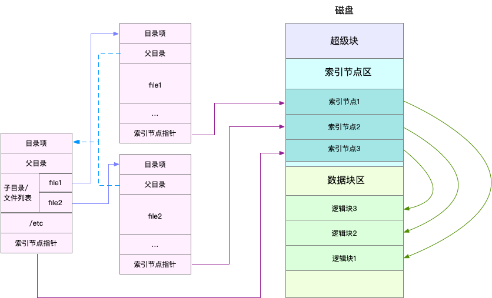

### 索引节点和目录项

- Linux 文件系统为每个文件都分配两个数据结构，索引节点（index node）和目录项（directory entry）。它们主要用来记录文件的元信息和目录结构
    - 索引节点，简称为 inode，用来记录文件的元数据，比如 inode 编号、文件大小、访问权限、修改日期、数据的位置等。索引节点和文件一一对应，它跟文件内容一样，都会被持久化存储到磁盘中。所以记住，索引节点同样占用磁盘空间。
    - 目录项，简称为 dentry，用来记录文件的名字、索引节点指针以及与其他目录项的关联关系。多个关联的目录项，就构成了文件系统的目录结构。不过，不同于索引节点，目录项是由内核维护的一个内存数据结构，所以通常也被叫做目录项缓存。

- 磁盘读写的最小单位是扇区，然而扇区只有 512B 大小，如果每次都读写这么小的单位，效率一定很低。所以，文件系统又把连续的扇区组成了逻辑块，然后每次都以逻辑块为最小单元，来管理数据。常见的逻辑块大小为 4KB，也就是由连续的 8 个扇区组成。

- 第一，目录项本身就是一个内存缓存，而索引节点则是存储在磁盘中的数据。在前面的 Buffer 和 Cache 原理中，我曾经提到过，为了协调慢速磁盘与快速 CPU 的性能差异，文件内容会缓存到页缓存 Cache 中。
- 第二，磁盘在执行文件系统格式化时，会被分成三个存储区域，超级块、索引节点区和数据块区。其中，
    - 超级块，存储整个文件系统的状态。
    - 索引节点区，用来存储索引节点。
    - 数据块区，则用来存储文件数据。