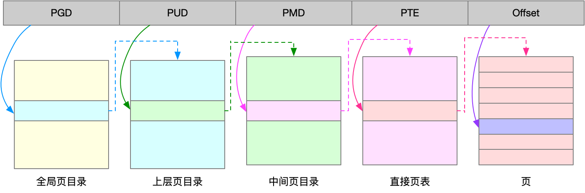

### 内存映射

- Linux 内核给每个进程都提供了一个独立的虚拟地址空间，并且这个地址空间是连续的。这样，进程就可以很方便地访问内存，更确切地说是访问虚拟内存。
- 虚拟地址空间的内部又被分为内核空间和用户空间两部分，不同字长（也就是单个 CPU 指令可以处理数据的最大长度）的处理器，地址空间的范围也不同。比如最常见的 32 位和 64 位系统，我画了两张图来分别表示它们的虚拟地址空间，如下所示：


    
  - 通过这里可以看出，32 位系统的内核空间占用 1G，位于最高处，剩下的 3G 是用户空间。而 64 位系统的内核空间和用户空间都是 128T，分别占据整个内存空间的最高和最低处，剩下的中间部分是未定义的。


- 进程在用户态时，只能访问用户空间内存；只有进入内核态后，才可以访问内核空间内存。虽然每个进程的地址空间都包含了内核空间，但这些内核空间，其实关联的都是相同的物理内存。这样，进程切换到内核态后，就可以很方便地访问内核空间内存。既然每个进程都有一个这么大的地址空间，那么所有进程的虚拟内存加起来，自然要比实际的物理内存大得多。所以，并不是所有的虚拟内存都会分配物理内存，只有那些实际使用的虚拟内存才分配物理内存，并且分配后的物理内存，是通过**内存映射**来管理的。
- 内存映射，其实就是将虚拟内存地址映射到物理内存地址。为了完成内存映射，内核为每个进程都维护了一张页表，记录虚拟地址与物理地址的映射关系，如下图所示。而当进程访问的虚拟地址在页表中查不到时，系统会产生一个缺页异常，进入内核空间分配物理内存、更新进程页表，最后再返回用户空间，恢复进程的运行。


- TLB(Translation Lookaside Buffer) 其实就是 MMU 中页表的高速缓存。由于进程的虚拟地址空间是独立的，而 TLB 的访问速度又比 MMU 快得多，所以，通过减少进程的上下文切换，减少 TLB 的刷新次数，就可以提高 TLB 缓存的使用率，进而提高 CPU 的内存访问性能。(?)
- 页的大小只有 4 KB ，导致的另一个问题就是，整个页表会变得非常大。比方说，仅 32 位系统就需要 100 多万个页表项（4GB/4KB），才可以实现整个地址空间的映射。为了解决页表项过多的问题，Linux 提供了两种机制，也就是多级页表和大页（HugePage）
  - 多级页表就是把内存分成区块来管理，将原来的映射关系改成区块索引和区块内的偏移。由于虚拟内存空间通常只用了很少一部分，那么，多级页表就只保存这些使用中的区块，这样就可以大大地减少页表的项数。Linux 用的正是四级页表来管理内存页，如下图所示，虚拟地址被分为 5 个部分，前 4 个表项用于选择页，而最后一个索引表示页内偏移。



  - 再看大页，顾名思义，就是比普通页更大的内存块，常见的大小有 2MB 和 1GB。大页通常用在使用大量内存的进程上，比如 Oracle、DPDK 等。

### 虚拟内存空间分布


- 通过这张图你可以看到，用户空间内存，从低到高分别是五种不同的内存段。
  - 只读段，包括代码和常量等。
  - 数据段，包括全局变量等。
  - 堆，包括动态分配的内存，从低地址开始向上增长。
  - 文件映射段，包括动态库、共享内存等，从高地址开始向下增长。
  - 栈，包括局部变量和函数调用的上下文等。栈的大小是固定的，一般是 8 MB。

- 在这五个内存段中，堆和文件映射段的内存是动态分配的。比如说，使用 C 标准库的 malloc() 或者 mmap() ，就可以分别在堆和文件映射段动态分配内存。其实 64 位系统的内存分布也类似，只不过内存空间要大得多。那么，更重要的问题来了，内存究竟是怎么分配的呢？


### 内存分配与回收

- malloc() 是 C 标准库提供的内存分配函数，对应到系统调用上，有两种实现方式，即 brk() 和 mmap()。当这两种调用发生后，其实并没有真正分配内存。这些内存，都只在首次访问时才分配，也就是通过缺页异常进入内核中，再由内核来分配内存。
  - 对小块内存（小于 128K），C 标准库使用 brk() 来分配，也就是通过移动堆顶的位置来分配内存。这些内存释放后并不会立刻归还系统，而是被缓存起来，这样就可以重复使用。
    - brk() 方式的缓存，可以减少缺页异常的发生，提高内存访问效率。不过，由于这些内存没有归还系统，在内存工作繁忙时，频繁的内存分配和释放会造成内存碎片。
  - 而大块内存（大于 128K），则直接使用内存映射 mmap() 来分配，也就是在文件映射段找一块空闲内存分配出去。
    - 而 mmap() 方式分配的内存，会在释放时直接归还系统，所以每次 mmap 都会发生缺页异常。在内存工作繁忙时，频繁的内存分配会导致大量的缺页异常，使内核的管理负担增大。这也是 malloc 只对大块内存使用 mmap 的原因。
- 系统也不会任由某个进程用完所有内存。在发现内存紧张时，系统就会通过一系列机制来回收内存，比如下面这三种方式：
  - 回收缓存，比如使用 LRU（Least Recently Used）算法，回收最近使用最少的内存页面；
  - 回收不常访问的内存，把不常用的内存通过交换分区直接写到磁盘中；
    - 第二种方式回收不常访问的内存时，会用到交换分区（以下简称 Swap）。Swap 其实就是把一块磁盘空间当成内存来用。它可以把进程暂时不用的数据存储到磁盘中（这个过程称为换出），当进程访问这些内存时，再从磁盘读取这些数据到内存中（这个过程称为换入）。所以，你可以发现，Swap 把系统的可用内存变大了。不过要注意，通常只在内存不足时，才会发生 Swap 交换。并且由于磁盘读写的速度远比内存慢，Swap 会导致严重的内存性能问题。
  - 杀死进程，内存紧张时系统还会通过 OOM（Out of Memory），直接杀掉占用大量内存的进程。
    - OOM, 它监控进程的内存使用情况，并且使用 oom_score 为每个进程的内存使用情况进行评分：
      - 一个进程消耗的内存越大，oom_score 就越大；
      - 一个进程运行占用的 CPU 越多，oom_score 就越小。

### 如何查看内存使用情况

- free

```shell
(base) server@server:~$ free
              total        used        free      shared  buff/cache   available
Mem:       32554244    10453196     3655320      708840    18445728    20816460
Swap:             0           0           0
```

  - free 输出的是一个表格，其中的数值都默认以字节为单位。表格总共有两行六列，这两行分别是物理内存 Mem 和交换分区 Swap 的使用情况，而六列中，每列数据的含义分别为：
    - 第一列，total 是总内存大小；
    - 第二列，used 是已使用内存的大小，包含了共享内存；
    - 第三列，free 是未使用内存的大小；
    - 第四列，shared 是共享内存的大小；
    - 第五列，buff/cache 是缓存和缓冲区的大小；
    - 最后一列，available 是新进程可用内存的大小。available 不仅包含未使用内存，还包括了可回收的缓存，所以一般会比未使用内存更大。不过，并不是所有缓存都可以回收，因为有些缓存可能正在使用中。