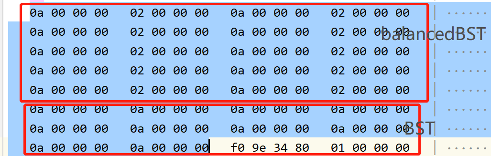

### Basics


##### references and pointers

- 没有所谓的`null reference`，一个`reference`必须总代表某个对象
- `reference`必须有初值，`pointer`可以没有初值
- `pointer`可以被重新赋值，指向另一个对象；`reference`总是指向它最初获得的那个对象


#### 最好使用C++转型操作符

- C++最新的4个新的转型操作符：`static_cast`, `const_cast`, `dynamic_cast`, `reinterpret_cast`
  - `static_cast`：和C旧式转型相同
  - `const_cast`：去除对象的常量性（`const`）
  - `dynamic_cast`：安全的向下转型或跨系转型操作

#### 绝不要以多态的方式处理数组

考虑：
```c++
class BST{...}
class BalancedBST: public BST {...}

void printBSTArry(ostream& s, const BST array[], int num){
    for(int i = 0 ; i < num ; i ++){
        s << array[i];      //假设BST objects 有一个operator << 可用
    }
}


BST bstArry[10];
printBSTArry(cout , bstArry, 10); // OK!


BalancedBST bBSTArry[10];
printBSTArry(cout, bBSTArry, 10); //????
```


- `array[i]` 编译器会认为`array`的类型为`BST`而不是`BalancedBST`,会出现不可预知的错误。
- 下图是假设`BST`有一个`int`变量；`BalancedBST`有两个变量，内存图




#### 非必要不提供 `default constructor`

- 考虑一个类没有`default ctor`

```c++
class EquipmentPiece{
private:
    int IDNumber;

public:
    EquipmentPiece(int IDNumber);
};

EquipmentPiece::EquipmentPiece(int _IDNumber) {
    IDNumber = _IDNumber;
}


EquipmentPiece ep[10]; //Error!!无法调用ctor
EquimentPiece *bestPiece = new EquimentPiece[10]; //Error

// Solution
typedef EquipmentPiece *PEP;
PEP bestPieces[10]; // OK !
PEP* bestPieces = new PEP[10]; // OK!
```

- 方法有两个缺点：
  - 必须记得将数组的所有对象删除，如果忘记会造成资源泄露（resource leak）
  - 需要的内存会比较大，需要空间存放指针；也需要一些空间用来放置`objects`
- 类中没有`default ctor`会